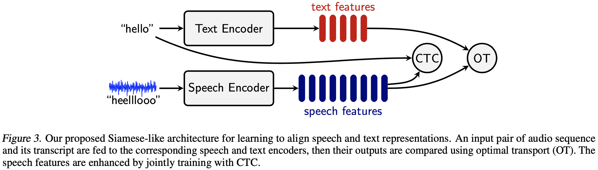
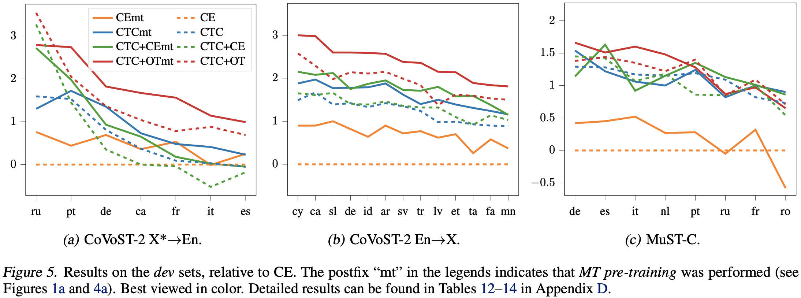

# Pre-training for Speech Translation: CTC Meets Optimal Transport

This is the codebase for the paper [Pre-training for Speech Translation: CTC Meets Optimal Transport](https://arxiv.org/abs/2301.11716), Le et al. (**ICML 2023, oral presentation**). Visit also our [project page](https://hangle.fr/publications/ctc-optimal-transport/) for additional materials.

# Table of Contents
1. [Overview](#1-overview)
2. [Pre-trained models](#2-pre-trained-models)
3. [Data Preparation](#3-data-preparation)
4. [Model Training](#4-model-training)
5. [Decoding](#5-decoding)
6. [References](#6-references)

# 1. Overview
## 1.1. Optimal Transport for Pre-training
Our main idea is to train the speech encoder to generate representations that are close to those produced by a text encoder. The challenge here is that, given the same sentence, its speech features typically have a *much longer sequence length* than its text features, which makes it difficult to *compare* them. The Wasserstein distance from optimal transport (OT) turns out to be a suitable solution.



## 1.2. Main results


The two tables below show the detailed results on MuST-C test set and summary of the results for CoVoST-2 test sets.

<table>
    <thead>
      <tr>
        <th>Model</th>
        <th>en-de</th>
        <th>en-es</th>
        <th>en-fr</th>
        <th>en-it</th>
        <th>en-nl</th>
        <th>en-pt</th>
        <th>en-ro</th>
        <th>en-ru</th>
        <th>avg</th>
      </tr>
      <tbody>
        <tr>
            <td>CE pre-training medium</td>
            <td>24.6</td>
            <td>28.7</td>
            <td>34.9</td>
            <td>24.6</td>
            <td>28.4</td>
            <td>30.7</td>
            <td>23.7</td>
            <td>15.9</td>
            <td>26.4</td>
       </tr>
       <tr>
            <td>CTC pre-training medium</td>
            <td>25.9</td>
            <td>29.7</td>
            <td>36.6</td>
            <td>25.6</td>
            <td>29.6</td>
            <td>32.0</td>
            <td>24.6</td>
            <td>16.7</td>
            <td>27.6</td>
       </tr>
       <tr>
            <td>CTC+CE pre-training medium</td>
            <td>25.6</td>
            <td>29.5</td>
            <td>36.4</td>
            <td>25.2</td>
            <td>29.5</td>
            <td>31.6</td>
            <td>24.5</td>
            <td>16.5</td>
            <td>27.4</td>
       </tr>
       <tr>
            <td>Siamese-PT medium</td>
            <td><u>26.2</td>
            <td><u>29.8</td>
            <td><u>36.9</td>
            <td><u>25.9</td>
            <td><u>29.8</td>
            <td><u>32.1</td>
            <td><u>24.8</td>
            <td><u>16.8</td>
            <td><u>27.8</td>
       </tr>
       <tr>
            <td>CE pre-training large</td>
            <td>26.9</td>
            <td>30.8</td>
            <td>37.7</td>
            <td>26.7</td>
            <td>30.8</td>
            <td>33.3</td>
            <td>26.2</td>
            <td>17.9</td>
            <td>28.8</td>
       </tr>
       <tr>
            <td>CTC pre-training large</td>
            <td>27.6</td>
            <td>31.4</td>
            <td>38.2</td>
            <td>27.2</td>
            <td>31.1</td>
            <td>33.6</td>
            <td>26.4</td>
            <td>18.4</td>
            <td>29.2</td>
       </tr>
       <tr>
            <td>CTC+CE pre-training large</td>
            <td>27.2</td>
            <td>31.2</td>
            <td>38.0</td>
            <td>27.0</td>
            <td>31.5</td>
            <td>33.7</td>
            <td>26.2</td>
            <td>18.3</td>
            <td>29.1</td>
       </tr>
       <tr>
            <td>Siamese-PT large</td>
            <td><b>27.9</td>
            <td><b>31.8</td>
            <td><b>39.2</td>
            <td><b>27.7</td>
            <td><b>31.7</td>
            <td><b>34.2</td>
            <td><b>27.0</td>
            <td><b>18.5</td>
            <td><b>29.8</td>
       </tr>
  </tbody>
</table>

**Table 1: Performance on MuST-C test set.**


<table>
    <tr>
        <td><b>Method</td>
        <td><b>En->X</td>
        <td><b>X<sup>**</sup>->En</td>
    </tr>
    <tr>
        <td>Wang et al. [1]</td>
        <td>19.4</td>
        <td>24.5</td>
    </tr>
    <tr>
        <td>CE</td>
        <td>19.2</td>
        <td>24.6</td>
    </tr>
    <tr>
        <td>CTC</td>
        <td>19.8</td>
        <td>24.7</td>
    </tr>
    <tr>
        <td>CTC+CE</td>
        <td>19.7</td>
        <td>24.5</td>
    </tr>
    <tr>
        <td>Siamese-PT</td>
        <td><b>21.5</td>
        <td><b>25.5</td>
    </tr>
</table>
[1] Wang et al., 2020. Covost 2 and massively
multilingual speech-to-text translation.

**Table 2: BLEU on CoVoST-2 set.** `X`<sup>**</sup>`->En` denotes the average excluding those of very low-resource, as discussed in Section 6.3 of the paper and those not reported in Table 3 Wang et al. [1]. See Tables 18 and 13 (Appendix E) in the paper for detailed results. The reported results are obtained using large model for `En->X` and medium model for `X->En`, which is better than the large one (Wang et al., 2020).


# 2. Pre-trained models
All pre-trained models, including [MT](#21-mt-models), [ASR](#22-asr-models), and [ST](#23-st-models), are made publicly available for download. 


## 2.1. MT models
For MuST-C bilingual MT models, we used the ones provided in [Joint Speech Text Training example](https://github.com/facebookresearch/fairseq/blob/main/examples/speech_text_joint_to_text/docs/ende-mustc.md) and trained our multilingual MT models (for both MuST-C and CoVoST-2) ourselves.
- [MuST-C En-De](https://dl.fbaipublicfiles.com/joint_speech_text_4_s2t/must_c/en_de/checkpoint_mt.pt), [MuST-C En-Fr](https://dl.fbaipublicfiles.com/joint_speech_text_4_s2t/must_c/en_fr/checkpoint_mt.pt), [MuST-C one-to-many](https://zenodo.org/record/7646534/files/mustc_all_mt_pho2spm.pt?download=1)

- [CoVoST one-to-many](https://zenodo.org/record/7646534/files/covost_en2xx_mt_pho2spm.pt?download=1), [CoVoST many-to-one](https://zenodo.org/record/7646534/files/covost_xx2en_mt_spm2spm.pt?download=1)

## 2.2. ASR models
`CE`, `CTC`, `CTC+CE`, and `CTC+OT` indicate the loss(es) used during the ASR pre-training stage. `CE`, `CTC`, and `OT`, respectively, stand for cross-entropy, connectionist temporal classification, and optimal transport.
- **MuST-C**
    * En-De: [CE](https://zenodo.org/record/7645707/files/mustc_ende_asr_ce.pt?download=1), [CTC](https://zenodo.org/record/7645707/files/mustc_ende_asr_ctc.pt?download=1), [CTC+CE](https://zenodo.org/record/7645707/files/mustc_ende_asr_ctc_ce0.1.pt?download=1), [CTC+OT](https://zenodo.org/record/7645707/files/mustc_ende_asr_ctc_ot0.1.pt?download=1)
    * En-Fr: [CE](https://zenodo.org/record/7645707/files/mustc_enfr_asr_ce.pt?download=1), [CTC](https://zenodo.org/record/7645707/files/mustc_enfr_asr_ctc.pt?download=1), [CTC+CE](https://zenodo.org/record/7645707/files/mustc_enfr_asr_ctc_ce0.1.pt?download=1), [CTC+OT](https://zenodo.org/record/7645707/files/mustc_enfr_asr_ctc_ot0.1.pt?download=1)
    * One-to-many: [CE](https://zenodo.org/record/7645707/files/mustc_all_asr_ce_archl.pt?download=1), [CTC](https://zenodo.org/record/7645707/files/mustc_all_asr_ctc_archl.pt?download=1), [CTC+CE](), [CTC+OT](https://zenodo.org/record/7645707/files/mustc_all_asr_ctc_ot0.1_archl.pt?download=1)
<!-- TODO: re-upload ASR model for CTC+CE -->

- **CoVoST-2**
    * One-to-many: [CE](https://zenodo.org/record/7646534/files/covost_en_asr_ce.pt?download=1), [CTC](https://zenodo.org/record/7646534/files/covost_en_asr_ctc.pt?download=1), [CTC+CE](https://zenodo.org/record/7646534/files/covost_en_asr_ctc_ce0.1.pt?download=1), [CTC+OT](https://zenodo.org/record/7646534/files/covost_en_asr_ctc_ot0.1.pt?download=1), [CTC+OT large](https://zenodo.org/record/7646534/files/covost_en_asr_ctc_ot0.1_archl.pt?download=1)
    * Many-to-one: [CE](https://zenodo.org/record/7646534/files/covost_m2o_asr_ce.pt?download=1), [CTC](https://zenodo.org/record/7646534/files/covost_m2o_asr_ctc.pt?download=1), [CTC+CE](https://zenodo.org/record/7646534/files/covost_m2o_asr_ctc_ce0.1.pt?download=1), [CTC+OT](https://zenodo.org/record/7646534/files/covost_m2o_asr_ctc_ot0.1.pt?download=1)

## 2.3. ST models
`CE`, `CTC`, `CTC+CE`, and `CTC+OT` indicate the corresponding pre-trained speech encoder (obtained from the above ASR pre-trained stage) used to initialize the speech encoder in the ST model. The speech decoder is initialized using the MT decoder corresponding to each translation direction.

- **MuST-C**
    * En-De: [CE](https://zenodo.org/record/7645707/files/mustc_ende_st_init_ce_with_mt.pt?download=1), [CTC](https://zenodo.org/record/7645707/files/mustc_ende_st_init_ctc_with_mt.pt?download=1), [CTC+CE](https://zenodo.org/record/7645707/files/mustc_ende_st_init_ctc_ce0.1_with_mt.pt?download=1), [CTC+OT](https://zenodo.org/record/7645707/files/mustc_ende_st_init_ctc_ot0.1_with_mt.pt?download=1)
    * En-Fr: [CE](https://zenodo.org/record/7645707/files/mustc_enfr_st_init_ce_with_mt.pt?download=1), [CTC](https://zenodo.org/record/7645707/files/mustc_enfr_st_init_ctc_with_mt.pt?download=1), [CTC+CE](https://zenodo.org/record/7645707/files/mustc_enfr_st_init_ctc_ce0.1_with_mt.pt?download=1), [CTC+OT](https://zenodo.org/record/7645707/files/mustc_enfr_st_init_ctc_ot0.1_with_mt.pt?download=1)
    * One-to-many: [CE](https://zenodo.org/record/7645707/files/mustc_all_st_init_ce_archl_with_mt.pt?download=1), [CTC](https://zenodo.org/record/7645707/files/mustc_all_st_init_ctc_archl_with_mt.pt?download=1), [CTC+CE](), [CTC+OT](https://zenodo.org/record/7645707/files/mustc_all_st_init_ctc_ot0.1_archl_with_mt.pt?download=1)

- **CoVoST-2**
    * One-to-many: [CE](https://zenodo.org/record/7646534/files/covost_en2xx_st_init_ce_with_mt.pt?download=1), [CTC](https://zenodo.org/record/7646534/files/covost_en2xx_st_init_ctc_with_mt.pt?download=1), [CTC+CE](https://zenodo.org/record/7646534/files/covost_en2xx_st_init_ctc_ce0.1_with_mt.pt?download=1), [CTC+OT](https://zenodo.org/record/7646534/files/covost_en2xx_st_init_ctc_ot0.1_with_mt.pt?download=1), [CTC+OT large](https://zenodo.org/record/7646534/files/covost_en2xx_st_init_ctc_ot0.1_archl_with_mt.pt?download=1)
    * Many-to-one: [CE](https://zenodo.org/record/7646534/files/covost_xx2en_st_init_ce_with_mt.pt?download=1), [CTC](https://zenodo.org/record/7646534/files/covost_xx2en_st_init_ctc_with_mt.pt?download=1), [CTC+CE](https://zenodo.org/record/7646534/files/covost_xx2en_st_init_ctc_ce0.1_with_mt.pt?download=1), [CTC+OT](https://zenodo.org/record/7646534/files/covost_xx2en_st_init_ctc_ot0.1_with_mt.pt?download=1).

# 3. Data Preparation
We follow the steps for data preparation provided by [`fairseq S2T`](https://github.com/pytorch/fairseq/tree/master/examples/speech_to_text) for both MuST-C and CoVoST-2, and follow the [Joint Speech Text Training example](https://github.com/facebookresearch/fairseq/blob/main/examples/speech_text_joint_to_text/docs/ende-mustc.md) to get phoneme representations for the transcripts. 

The commands to prepare data for MuST-C, for example, are as follows.

* Prepare the `.tsv` files for the *ST task*. 
```bash
python examples/speech_to_text/prep_mustc_data.py \
        --data-root ${MUSTC_ROOT} --task st \
        --vocab-type unigram --vocab-size 10000 \
        --langs $LANG \
        --min-n-frames 1 \
        --max-n-frames 3000
```
This results in `${SPLIT}_st.tsv` files (where `${SPLIT}` is `train`, `dev`, `tst-COMMON`, and `tst-HE`) together with the configuration and vocabulary files. Each `.tsv` file has the following collumns: `id   audio   n_frames    tgt_text    speaker src_text    src_lang    tgt_lang`.

* Prepare the `.tsv` files for the *ASR pre-training task* using SentencePiece vocabulary.
```bash
python examples/speech_to_text/prep_mustc_data.py \
        --data-root ${MUSTC_ROOT} --task asr \
        --vocab-type unigram --vocab-size 10000 \
        --langs $LANG \
        --min-n-frames 1 \
        --max-n-frames 3000
```
This command produces similar files as the above, but target text (`tgt_text`) is the transcripts instead of translation and the suffixes of the files are `_asr` instead of `_st`. 

* Get the phoneme representations of source text for the *ASR pre-training task* using phoneme vocabulary. 
    - First extract the source text from the field `src_text` of the `.tsv` files obtained from the step above. This can be done in Python for example as below.
    ```python
    from examples.speech_to_text.data_utils import load_df_from_tsv
    data = load_df_from_tsv(f"{MUSTC_ROOT}/en-{LANG}/{SPLIT}_st.tsv")
    texts = data[f"src_text"].tolist()
    with open(f"{MUSTC_ROOT}/en-{LANG}/{SPLIT}_src.txt", "w") as f:
        for line in texts:
            f.write("%s\n" % line)
    ```

    - Get the phoneme representations of the source text.
    ```bash
    python examples/speech_text_joint_to_text/scripts/g2p_encode.py \
            --lower-case --do-filter --use-word-start --no-punc \
            --reserve-word examples/speech_text_joint_to_text/configs/mustc_noise.list \
            --data-path ${MUSTC_ROOT}/en-${LANG}${SPLIT}_src.txt \
            --out-path ${MUSTC_ROOT}/en-${LANG}${SPLIT}_src_phoneme.txt
    ```

    - Add phoneme to the `.tsv` file: the `src_text` and `tgt_text` columns need to be the transcripts in its phoneme form.
    ```python
    from examples.speech_to_text.data_utils import load_df_from_tsv, save_df_to_tsv
    data = load_df_from_tsv(f"{MUSTC_ROOT}/en-{LANG}/{SPLIT}_st.tsv")
    texts = []
    with open(f"{MUSTC_ROOT}/en-{LANG}{SPLIT}_src_phoneme.txt", "r") as f:
        for line in f:
            texts.append(line.strip())
    data[f"src_text"] = texts
    data[f"tgt_text"] = texts
    save_df_to_tsv(data, f"{MUSTC_ROOT}/en-{LANG}/{SPLIT}_asr_phoneme.tsv")
    ```

# 4. Model Training
The common command for training on 1 GPU is as follow.
```bash
fairseq-train ${DATA_ROOT} \
        --config-yaml ${CONFIG_YAML} \
        --train-subset ${TRAIN_SUBSET} \
        --valid-subset ${VALID_SUBDET} \
        --save-dir ${SAVE_DIR} \
        --update-freq 8 \
        --max-tokens 40000 \
        --max-epoch ${MAX_EPOCH} \
        --warmup-updates 10000 \
        --user-dir examples/speech_text_siamese \
        --task ${FAIRSEQ_TASK} \
        --arch siamese_st2t_transformer_m \
        --criterion ${CRITERION} \
        --optimizer adam \
        --adam-betas "(0.9,0.98)" \
        --lr-scheduler inverse_sqrt \
        --lr 2e-3 \
        --clip-norm 10.0 \
        --dropout 0.2 \
        --tensorboard-logdir ${TENSORBOARD_LOGDIR} \
        --keep-last-epochs 10 \
        --log-interval 500 \
        --skip-invalid-size-inputs-valid-test \
        --seed 1 \
        --ddp-backend no_c10d
```
where `${DATA_ROOT}`is path to where the `.tsv` files, the configuration and vocabulary files are saved. `${MAX_EPOCH}` is set to 50 and 100 for ST and ASR training stages, respectively. `${SAVE_DIR}` and ` {TENSORBOARD_LOGDIR}` are where checkpoints and tensorboard will be saved, respectively. The specific parameters for each type of training are given in their corresponding sections.

## 4.1. ASR Pre-training
### Pre-training with cross-entropy loss
```bash
CONFIG_YAML=config_unigram10000_asr.yaml
TRAIN_SUBSET=train_asr
VALID_SUBDET=dev_asr
FAIRSEQ_TASK=siamese_speech_text_to_text
CRITERION=label_smoothed_cross_entropy
```

Additional arguments to be added to the command line:
```bash
--label-smoothing 0.1 \
--report-accuracy \
--no-text-encoder \
--use-speech-decoder
```

### Pre-training with CTC loss
```bash
CONFIG_YAML=config_unigram10000_asr.yaml
TRAIN_SUBSET=train_asr
VALID_SUBDET=dev_asr
FAIRSEQ_TASK=siamese_speech_text_to_text
CRITERION=wasserstein_augmented_loss
```

Additional arguments to be added to the command line:
```bash
--no-text-encoder \
--use-ctc-module \
--ctc-weight 1.0 \
--zero-infinity
```

### Pre-training with CTC+OT loss
```bash
CONFIG_YAML=config_phoneme_asr.yaml
TRAIN_SUBSET=train_asr_pho
VALID_SUBDET=dev_asr_pho
FAIRSEQ_TASK=siamese_speech_text_to_text
CRITERION=wasserstein_augmented_loss
```

Additional arguments to be added to the command line:
```bash
--no-text-encoder \
--use-text-encoder-aux \
--use-ctc-module \
--ctc-weight 1.0 \
--zero-infinity \
--ot-weight 0.1 \
--ot-position-weight 1.0 \
--load-pretrain-text-encoder ${PATH_TO_PRETRAINED_MT_MODEL}
```

## 4.2. ST Training
```bash
CONFIG_YAML=config_unigram10000_st.yaml
TRAIN_SUBSET=train_st
VALID_SUBDET=dev_st
FAIRSEQ_TASK=siamese_speech_text_to_text
CRITERION=label_smoothed_cross_entropy
```

Additional arguments to be added to the command line:
```bash
--label-smoothing 0.1 \
--report-accuracy \
--no-text-encoder \
--use-speech-decoder \
--load-pretrain-speech-decoder ${PATH_TO_PRETRAINED_ASR_MODEL}
```

# 5. Decoding
We average the last 10 checkpoints with the following command.
```bash
python scripts/average_checkpoints.py \
                --inputs ${SAVE_DIR} \
                --num-epoch-checkpoints 10 \
                --output ${SAVE_DIR}/avg_last_10_checkpoint.pt
```

Then we run the following command for decoding.
```bash
fairseq-generate ${DATA_ROOT} \
                --config-yaml ${CONFIG_YAML} \
                --gen-subset ${GEN_SUBSET} \
                --task siamese_speech_text_to_text \
                --user-dir examples/speech_text_siamese \
                --path ${SAVE_DIR}/avg_last_10_checkpoint.pt \
                --max-tokens 50000 --beam 5 \
                --max-source-positions 60000 \
                --results-path ${SAVE_DIR}/beam5 \
                --load-speech-only \
                --scoring sacrebleu
```

# 6. References
If you find the resources in this repository useful, please cite the following paper:

```bibtex
@inproceedings{le2023pretraining,
  author    = {Phuong{-}Hang Le and
               Hongyu Gong and
               Changhan Wang and
               Juan Pino and
               Benjamin Lecouteux and
               Didier Schwab},
  title     = {Pre-training for Speech Translation: {CTC} Meets Optimal Transport},
  booktitle   = {Proceedings of the 40th International Conference on Machine Learning},
  volume    = {PMLR 202},
  year      = {2023}
}
```